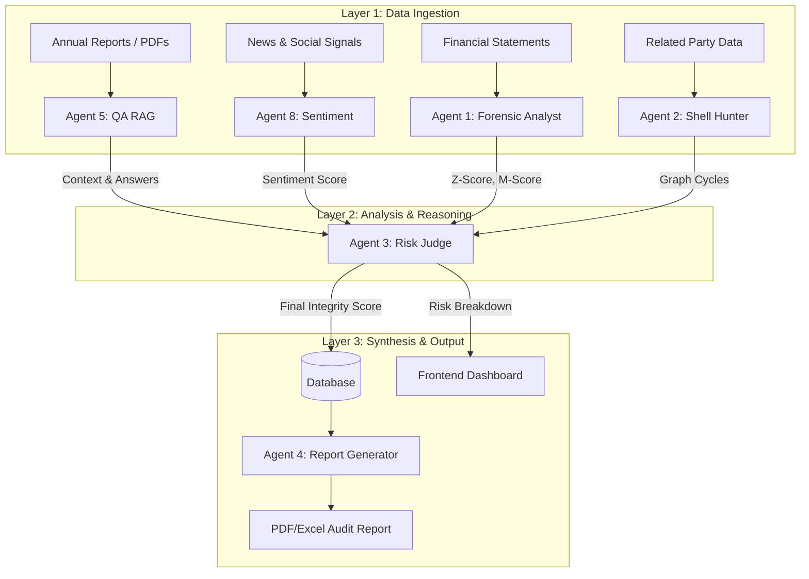

# IRIS: System Design & Architecture

## 1. System Overview
**Investigative Risk Intelligence System (IRIS)** is an advanced, autonomic multi-agent AI platform designed for real-time financial forensic analysis, fraud detection, and risk assessment. It moves beyond traditional static auditing by using a swarm of specialized AI agents to continuously monitor, analyze, and visualize corporate financial health.

## 2. High-Level Architecture

The system follows a modern microservices-like architecture powered by a "Council of Agents".

| Layer | Technologies | Description |
|-------|--------------|-------------|
| **Frontend** | Next.js, React, Tailwind CSS | Interactive dashboard with real-time charts (Recharts), network graphs (React Flow), and 3D geospatial elements. |
| **Backend** | Python, FastAPI, Uvicorn | High-performance API layer managing agent orchestration and data processing. |
| **AI Core** | Google Gemini (2.5 Flash), LangChain | The "brains" of the system. All agents utilize Gemini-2.5-flash for reasoning and generation. |
| **Data** | ChromaDB, Redis, NetworkX | Vector storage for RAG, caching for performance, and graph algorithms for network analysis. |

## 3. Data Flow Architecture

## 4. Key Capabilities
1.  **"Shell Hunter" Network Graph**: Visually explodes the web of related parties to reveal hidden money laundering cycles.
2.  **Live Risk Scoring**: Real-time updates to company risk profiles based on market moves and new filings.
3.  **Forensic Deep-Dive**: Tabs for Vertical/Horizontal analysis, Ratios, and Fraud Models.
4.  **Generative Reporting**: One-click generation of detailed audit reports.

## 5. User Experience (UX) Design
*   **Theme**: Cyber-Forensic / Institutional Dark Mode.
*   **Visuals**: Glassmorphism cards, D3.js transitions, "God-Mode" network graphs.
*   **Dashboard**: "Bento Box" layout with Risk Score Hero widget, Live Sparklines, and Alert feeds.
